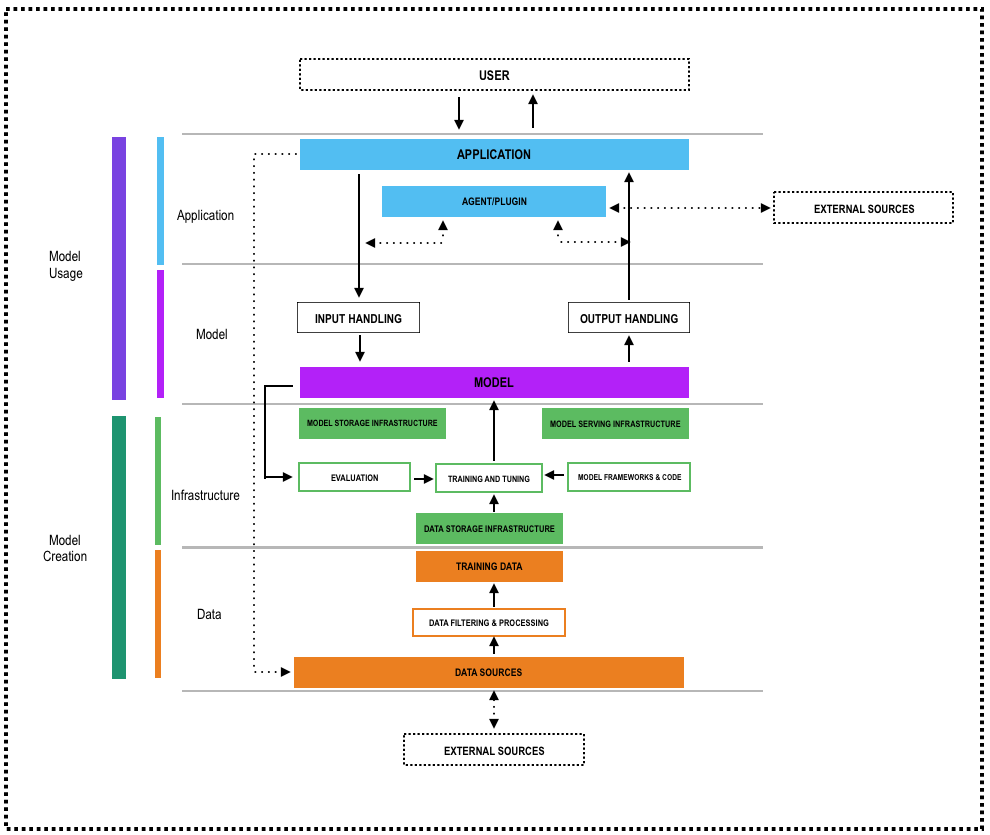

# 2. AI システムの脅威モデリング (Threat Modeling for AI Systems)

### 脅威モデリングとは何か？
脅威モデリングはシステムに対するセキュリティ脅威を特定し、定量化し、対処するための構造化されたプロセスです。これは、システムがどのように攻撃される可能性があるかを、開発者、アーキテクト、セキュリティ専門家が事前に評価し、開発ライフサイクルの早期に適切な防御策を設計できます。

AI システムにおいて、脅威モデリングは新しく高度な脅威ベクトルを明らかにし、データ資産に対する潜在的な攻撃経路を明確にし、技術的影響とビジネス的影響の両方を定量化します。これらのリスクは、プロンプトインジェクションからモデル抽出に至るまで、機械学習と生成 AI 技術の特有の特性から生じます。

### AI 脅威モデリングの主な目的
AI システムの脅威モデリングは、AI 固有の攻撃対象領域を特定し、影響度の高いリスク (敵対的攻撃や推論攻撃など) を優先順位付けし、ターゲットを絞ったテストをガイドすること目的としています。これは secure-by-design アーキテクチャを促進し、エンジニアリング、セキュリティ、コンプライアンスのチームにまたがる共通のリスク言語を構築し、規制デューデリジェンスのための文書化された証跡を提供します。脅威モデルを継続的に更新することで、組織は AI コンポーネントや脅威の進化に合わせて適応する、常に最新のリスクロードマップを維持します。  
AI 脅威モデリングは、目標の定義以外にも、以下を行います。
- **攻撃対象領域分析:** AI/ML システムをコンポーネント (データソース、トレーニングパイプライン、推論エンドポイント、モデルストア、オーケストレーションレイヤ) に分解します。データフローをマップし、悪意のある入力や流出が発生する可能性のある信頼境界を特定します。
- **資産とアクターの特定:** 重要な資産 (トレーニングデータセット、モデルパラメータ、推論 API) と、それらとやり取りするユーザーやプロセスをカタログ化します。権限レベルと潜在的な脅威アクター (外部攻撃者、不正な内部関係者、サードパーティサービス) を決定します。
- **脅威ライブラリマッピング:** 確立された脅威カタログを活用して、AI 固有の攻撃の包括的なカバレッジを確保します。
- **リスク分析と優先順位付け:** 脅威の発生可能性と影響度を、技術 (モデルの完全性、可用性) とビジネス (収益損失、風評被害) の両面から推定します。脅威をランク付けし、最もリスク低減できるテストと緩和策に焦点を当てます。
- **緩和戦略の定義:** 優先順位付けされた脅威ごとに、リスクを許容レベルに低減するために必要なアーキテクチャ制御、ランタイム防御、運用プロセスを指定します。

### AI 脅威モデリングフレームワークの選び方
Several established methodologies can be adapted to systematically identify and analyze threats against AI systems. Each brings a distinct perspective, ranging from business-driven, risk-centric approaches to privacy-focused evaluations and adversarial attack mappings. When applied thoughtfully, these frameworks help teams uncover AI-specific vulnerabilities, prioritize mitigations, and integrate security throughout the AI lifecycle.  
Below is an overview of the leading methods used for AI threat modeling:  
- **PASTA [9] (Process for Attack Simulation and Threat Analysis):** A seven-stage, risk-centric framework that aligns technical analysis with business impact.  
- **STRIDE [10]:** Microsoft’s STRIDE model categorizing threats into Spoofing, Tampering, Repudiation, Information Disclosure, Denial of Service, and Elevation of Privilege.  
- **MITRE ATLAS [11]:** Maps adversarial ML techniques (evasion, poisoning, model extraction) and corresponding mitigations.  
- **LINDDUN [12]:** A privacy-focused framework for modeling threats to data confidentiality and compliance (e.g., membership inference, data leakage).  

Choose a methodology that best aligns with your organization’s objectives, system complexity, and stakeholder needs:  
- **Business & Risk Alignment:** If your primary goal is to tie security analysis back to concrete business impact (e.g. quantifying loss exposure), a risk-centric framework like PASTA is ideal.  
- **Scope & Complexity:** Use broad, multi-stage processes (PASTA, MITRE ATLAS) for end-to-end AI pipelines; lighter taxonomies (STRIDE, OWASP LLM Top 10) work well for individual components.  
- **Audience & Maturity:** Executive and risk-management audiences often prefer high-level, business-focused outputs (PASTA’s business objectives stage, risk registers). Engineering teams may gravitate toward developer-friendly taxonomies (AI-STRIDE or MITRE ATLAS matrices) they can directly map to design patterns and code.  
- **Privacy vs. Security Focus:** If data confidentiality and compliance are paramount, incorporate a privacy-centric method (LINDDUN) alongside your core security approach. When adversarial robustness is the top concern, ensure your chosen framework includes or can easily integrate adversarial test case design (MITRE ATLAS or custom AI-STRIDE extensions).  
- **Tool & Process Fit:** Pick a methodology compatible with your existing SDLC, threat-modeling tools, and reporting dashboards. PASTA’s stages work well in risk-management platforms; STRIDE maps easily into threat-modeling tools like Threat Dragon.

### AI システムアーキテクチャ
It’s important to map threats to a comprehensive AI architecture. (*) As threats depend on system design, different parts of the AI system (data ingestion, training pipeline, model API, monitoring system) have different vulnerabilities. Without full architecture visibility, critical attack surfaces can be missed. Mapping threats to specific components also allows you to identify where threats can realistically occur, helping to prioritize risks instead of treating the system as a black box. When threats are mapped to the full architecture, layered security controls can be designed at each critical boundary (data, model, APIs, infrastructure), not just at the perimeter. Mapping threats systematically supports structured threat modeling (like STRIDE, PASTA, or LINDDUN for AI) making it easier to design specific, actionable countermeasures. Since threat modeling relies heavily on scope and context, it is crucial to select an architectural scope that reflects the most prevalent AI threats and aligns with the technical and business use cases that underpin most AI applications today.  
In Stage II of PASTA, we define the architectural scope by aligning it with the Secure AI Framework (SAIF) [12], establishing a structured view of the AI system’s core security-relevant components. SAIF serves as a publicly available model for securing AI systems at scale, offering a practical, adaptable, and business-aligned framework that connects AI system security with broader risk management and operational resilience objectives. Specifically, the SAIF Risk Map [13] serves as a visual guide for navigating AI security and is central to understanding SAIF as a comprehensive security framework. It highlights many risks that may be unfamiliar to developers, such as prompt injection, data poisoning, and rogue actions. By mapping the AI development process, the SAIF Map helps identify where these risks emerge and, critically, where corresponding security controls can be applied. In Fig. 1 we provide the visual of the SAIF components.

  

*Fig. 1 SAIF Architecture Layers & Components*

The SAIF Map organizes AI security into four key areas: Application, Model, Infrastructure and Data, allowing scope AI protection across the full AI development lifecycle. The top half highlights the model’s path to deployment and user interaction, focusing on risks and controls most relevant to Model Consumers building AI-powered applications. The bottom half of the SAIF Map illustrates the process of developing a model, focusing on Model Creators, those who train or fine-tune models for their own use or for others. Depending on how AI is used, different risks may have greater relevance.  
The SAIF Risk Map illustrates where risks are introduced during the AI development lifecycle, often as a result of weaknesses in people, processes, or tools, where they are exposed (i.e., observable or testable by security teams), and where they can ultimately be mitigated through the implementation of appropriate controls. Some of these risk paths manifest primarily in the model usage layers (Application and Model) and relative AI components, others emerge in the model creation layers (Infrastructure and Data), and many span both, underscoring the need for comprehensive security coverage across the entire AI system lifecycle.  
By adopting Google’s Secure AI Framework (SAIF), we focus on its top-level domains: Data, Training, Inference, and Deployment, rather than unpacking every subcomponent (for example, RAG or memory modules). This alignment with SAIF’s structure keeps our model clear and avoids unnecessary complexity.

### AI システムアーキテクチャ脅威モデリング
In selecting a threat modeling methodology, we highlight some primary approaches for risk-centric framework that aligns technical analysis with business impact such as PASTA, MITRE ATLAS as chosen framework includes or can easily integrate adversarial test case design and STRIDE & STRIDE AI for developer-friendly threat taxonomies. Regardless of the methodology chosen, the essential desired outcome remains the same: to systematically map threats to the reference AI architecture defined by the SAIF Risk Map, covering the core components of application, data, model, and infrastructure.  
The goal is to conduct a comprehensive threat analysis that leverages both STRIDE threat categories and AI-specific threats. These identified threats serve as the foundation for designing threat- and attack-driven testing, which is used to uncover control gaps, weaknesses, and vulnerabilities. The likelihood and impact of these vulnerabilities, both technical and business, form dimensions of risk that must be evaluated and mitigated accordingly.  
When adopting a risk-based methodology like PASTA, the process begins with defining the business objective: securing AI-powered services that deliver critical functionality (e.g., personalized recommendations, predictive analytics, autonomous decision-making) while mitigating risks such as loss of customer trust, regulatory penalties, and competitive threats from model compromise.  
Using the SAIF risk map, Stage 2 of PASTA establishes a comprehensive technical scope, covering users, applications, models, data, and infrastructure. At stage 3 of PASTA we seek to decompose the architecture into four key layers and map high-level data flows. During PASTA stage 4 we seek to conduct a detailed threat analysis for AI-specific threats. PASTA stages 5 and 6 focus on identifying vulnerabilities through targeted testing and simulating realistic attack scenarios. Finally, during PASTA stage 7 assesses the severity of unmitigated risks and outlines mitigation strategies based on industry best practices.  
Alternatively, if STRIDE is adopted directly as the primary threat modeling approach, the process differs, as STRIDE serves as a threat classification framework rather than a full end-to-end risk centric threat modeling methodology like PASTA. In this approach, the six STRIDE threat categories can still be systematically applied across the SAIF architecture components, application, model, data, and infrastructure, to ensure comprehensive threat coverage. However, using STRIDE alone requires additional steps to incorporate risk scoring, simulate realistic attack scenarios, and align threats with business and operational context, capabilities that PASTA integrates inherently into its methodology.  
In PASTA’s seven‐stage process, we’ll enhance the Threat Analysis phase by incorporating MITRE ATLAS’s database of AI‐specific adversarial tactics, such as evasion, poisoning, model extraction, and inference attacks, into our threat mapping. This integration ensures our risk‐centric model aligns with business priorities and technical scope, while directly informing a targeted suite of offensive AI tests against the most critical attack vectors. AI-specific adversarial tactics such as evasion, poisoning, and model extraction are prime targets for specialized AI security assessments like red teaming. This focus is formally captured in the OWASP AI Red Teaming Framework [14], which defines how to simulate and evaluate these attack vectors against AI systems.  
Effective threat modeling begins by scoping the analysis around the critical assets you must protect. To do this, you first decompose the system’s architecture into its essential components, services, data stores, interfaces, and supporting infrastructure. You then map out how these pieces interact by drawing data flow diagrams that trace information end-to-end, highlight entry and exit points, and establish trust boundaries. By visualizing where data is stored, processed, and transmitted, you can pinpoint the exact assets at risk and systematically identify potential threats and vulnerabilities against each component and boundary. This structured approach ensures your threat model remains focused, comprehensive, and aligned with the organization’s security priorities.  
These scoping and decomposition activities, identifying critical assets, breaking the system into core components, and using data flow diagrams to map end-to-end interactions and trust boundaries are foundational steps shared by many threat-modeling methodologies, from STRIDE to PASTA and beyond, ensuring a consistent, thorough approach to identifying and prioritizing risks.  
By focusing on the SAIF-aligned layers, Application, Data, Model, and Infrastructure, we intentionally keep our threat analysis at a high architectural level. This ensures broad coverage of AI-specific risks without delving into every sub-component of the system.  
In this AI threat model, we map threats, including AI-specific threats across the application, data, model, and infrastructure layers to ensure comprehensive coverage. Threat mitigations are defined as testable requirements, with validation activities documented in this guide. The goal is to provide a complete set of tests to assess the AI system’s security posture against the identified threats (Note).  
Note: It’s important to note that the OWASP AI Testing Guide is scoped to post-deployment security assessments and does not cover the broader MLOps lifecycle. For teams seeking guidance on embedding adversarial robustness tests earlier during data preparation, model training, and CI/CD pipelines, we recommend the white paper in ref [16] Securing AI/ML Systems in the Age of Information Warfare which provides an excellent deep dive into adversarial testing techniques within the AI/ML development process as well as ref[17] John Sotiroupulos book.

### アーキテクチャの分解
Architecture decomposition in threat modeling is the process of breaking down a system into its key components, data flows, assets, and trust boundaries. It helps identify where threats can occur, supports systematic threat enumeration (like STRIDE), highlights the attack surfaces allowing to identify all potential entry points and exposure surfaces.  
Following PASTA Stage III, we perform a decomposition of the AI architecture, organizing it into the four layers and component groups defined by SAIF: Data, Model, Infrastructure, and Application, enabling a structured and comprehensive threat analysis.  
The SAIF (Secure AI Framework) model provides a high-level architectural view of AI systems, designed to capture the broad categories of components, such as data, model, application, and infrastructure that are critical to securing the AI lifecycle. While this abstraction is valuable for establishing a common baseline for AI security, it is not intended to offer detailed decomposition of every specific implementation pattern.  
The approach we recommend for AI threat modeling begins with a high-level architectural view, such as the one provided by frameworks like Google’s SAIF or OWASP AI Security Matrix to establish comprehensive coverage across data, model, application, and infrastructure layers. From there, the model should be refined to a level of detail that reflects the specific deployment context of the AI system, including the technologies, data flows, and integration points involved.  
This deeper level of modeling is essential for identifying the actual attack surface, tied to the specific AI use case. For example, in a Robotic Process Automation (RPA) workflow for automated employee expense reimbursement, threat modeling should capture exposures in third-party integrations, data handling, and business logic as covered in [21]. In more complex architectures such as multi-agent systems (MAS) or Retrieval-Augmented Generation (RAG) (Note) pipelines, threat modeling must extend beyond what SAIF alone provides and provide coverage for threats, vulnerabilities and controls at very specific level as documented in [22].  
While SAIF is useful for scoping, it may not offer the granularity required to fully analyze these hybridized, dynamically orchestrated components. Therefore, deeper decomposition is necessary to evaluate the threat landscape and test for control effectiveness in real-world AI deployments.  
Note: While RAG (Retrieval-Augmented Generation) isn’t explicitly defined in the SAIF architecture, it maps across several SAIF components due to its composite structure. It involves Data (external sources vulnerable to poisoning), the Model (susceptible to prompt manipulation), the Application layer (which coordinates retrieval and generation, introducing chaining risks), and Infrastructure (which supports vector DBs and LLM services requiring secure configuration).

### アプリケーション層
The application layer encompasses the application and any associated agents or plugins. It interfaces with users for input and output and with the AI model for processing and response. Agents and plugins extend functionality but also introduce additional transitive risks that must be managed.  
The “Application” refers to the product, service, or feature that leverages an AI model to deliver functionality. Applications may be user-facing, such as a customer service chatbot, or service-oriented, where internal systems interact with the model to support upstream processes.  
The “Agent/plugin” refers to a service, application, or supplementary model invoked by an AI application or model to perform a specific task, often referred to as ‘tool use.’ Because agents or plugins can access external data or initiate requests to other models, each invocation introduces additional transitive risks, potentially compounding the existing risks inherent in the AI development process.  
The application layer can be decomposed in the following sub-components:  
- **The User (SAIF #1):** this is the person or system initiating requests and receiving responses.  
- **The User Input (SAIF #2):** these are inputs (queries, commands) submitted by the user.  
- **The User Output (SAIF #3):** These are output such as answers to user actions that are returned by the application to the user.  
- **The Application (SAIF #4):** This is the core logic that receives user I/O, determines whether to call the AI model or an external service, and formats the response.  
- **The Agents/Plugin (SAIF #5) (Note):** are the processes that interact with the application and or the model to deliver the specific functionality such as retrieval tools or third-party APIs that extend functionality but introduce additional trust boundaries.  
- **The External Sources (SAIF #6):** These are databases, services, or APIs these agents rely on, each representing an external entity and potential risk point.  
  - Note: This guide limits its scope to mapping threats against SAIF-defined assets for testing purposes. The rationale for the choice of SAIF as the scope for the AI Threat Modeling is documented in Appendix A.  
  - Note: The dotted line from SAIF #5 (Agents/Plugins) to SAIF #6 (External Sources) reflects that plugins dynamically retrieve or query untrusted data from external services at runtime.

### モデル層
The Model layer covers the core AI or ML components themselves, the logic, parameters, and runtime that transform inputs into outputs. It sits between the application (and any agents/plugins) and the underlying infrastructure or data. Because this layer embodies the “black box” of AI, it demands careful handling of inputs, outputs, and inference operations to prevent poisoning, leakage, or misuse.  
The model layer can be decomposed in the following sub-components:  
- **The Input Handling (SAIF #7) (Note):** whose purpose is to validate and sanitize all data, prompts, or feature vectors before they reach the model to prevent injection attacks, data poisoning, or malformed inputs that could lead to unintended behavior. The input handling comprises three key functions: an Input Validator to clean or reject bad data, Authentication & Authorization to allow only authorized callers, and a Rate Limiter to prevent denial-of-service or brute-force attacks.  
- **The Output Handling (SAIF #8) (Note):** whose purpose is to filter, redact, or post-process model outputs to ensure they do not expose sensitive training data, violate privacy, or produce harmful content. It includes an Output Filter to detect and block harmful or disallowed content, Sanitization & Redaction to remove sensitive or private information, and a Response Validator to confirm outputs meet format and business rules before delivery.  
- **The Model Usage (SAIF #9):** whose purpose is to execute the model against approved inputs in a controlled, auditable environment, ensuring that inference logic cannot be tampered with or subverted at runtime. It includes: the Inference Engine for loading weights and computing outputs, Policy Enforcement to apply guardrails (e.g., token limits, safe decoding), and an Audit Logger to record inputs, model versions, and outputs for traceability.  
  - Note: The two dotted lines from SAIF #5 (Agents/Plugins) to SAIF #7 (Input Handling) and SAIF #8 (Output Handling) reflect how plugins can dynamically alter prompts or post-process model outputs.

### インフラストラクチャ層
The infrastructure layer provides the foundational compute, networking, storage, and orchestration services that host and connect all other AI system components. It ensures resources are provisioned, isolated, and managed securely, supporting everything from data processing and model training to inference and monitoring.  
The infrastructure layer can be decomposed in the following sub-components (Note):  
- **Model Storage Infrastructure (SAIF #10):** This component safeguards the storage and retrieval of model artifacts, such as weight files, configuration data, and versioned metadata, ensuring they remain confidential, intact, and available. An artifact repository maintains versioning and enforces encryption at rest, while an integrity verifier computes and checks cryptographic hashes (e.g., SHA-256) on each upload and download to detect tampering. A key management service issues and rotates encryption keys under least-privilege policies, preventing unauthorized decryption of stored models.  
- **Model Serving Infrastructure (SAIF #11):** This component provides the runtime environment in which models execute inference requests. It isolates the model execution process from other workloads, enforces resource quotas and rate limits, and ensures that only properly formatted inputs reach the model. Health-monitoring mechanisms detect failures or performance degradations, and automatic scaling or load-balancing ensures uninterrupted availability under varying demand.  
- **Model Evaluation (SAIF #12):** This component measures model performance, fairness, and robustness before and after deployment. A validation suite runs the model against reserved test sets—including adversarial or edge-case inputs—and collects metrics on accuracy, bias, and error rates. Drift-detection tools compare new outputs to historical baselines to flag significant deviations, and reporting dashboards surface any regressions or policy violations for corrective action.  
- **Model Training & Tuning (SAIF #13):** This component orchestrates the end-to-end process of creating and refining models on curated datasets. Training pipelines manage data preprocessing, feature engineering, and iterative model fitting under controlled conditions. Hyperparameter-management tools record each experiment’s settings and results, while data-sanitization routines anonymize or filter sensitive information to protect privacy during training.  
- **Model Frameworks & Code (SAIF #14):** This component includes the libraries, frameworks, and custom code that define model architectures and training routines. Static analysis and dependency-scanning tools detect known vulnerabilities in third-party packages. Secure-by-design code reviews enforce best practices—avoiding unsafe dynamic execution or hard-coded credentials—and hardened runtime environments limit the attack surface of any model-serving or training code.  
- **Data Storage Infrastructure (SAIF #15):** Although “Data” spans its own SAIF domain, model-specific storage systems—such as feature stores or embedding indexes—require dedicated security controls. These stores enforce access policies, validate data schemas and formats, and log all read/write operations for traceability. Encryption at rest and in transit protects sensitive inputs and intermediate artifacts, while regular integrity checks ensure no unauthorized modifications occur.

### データ層
The Data layer underpins every AI system by supplying the raw and processed information that models consume. It encompasses the entire lifecycle of data, from initial collection and ingestion through transformation, storage, and provisioning for training or inference and ensures that data remains accurate, trustworthy, and compliant with privacy and security policies. Robust controls in this layer protect against poisoning, leakage, and unauthorized access, forming the foundation for reliable, responsible AI outcomes.  
The data layer can be decomposed in the following sub-components:  
- **Training Data (SAIF #16):** Training data consists of curated, labeled examples used to teach the model how to recognize patterns and make predictions. In a secure AI pipeline, organizations establish strict provenance and versioning for training datasets to guarantee integrity: every record’s origin, modification history, and access events are logged and auditable. By enforcing encryption-at-rest and role-based permissions on training repositories, the system prevents unauthorized tampering; any illicit change to the training corpus would corrupt the model’s learning process and open the door to adversarial manipulation.  
- **Data Filtering and Processing (SAIF #17):** Before feeding raw inputs into model pipelines, data undergoes rigorous filtering and processing steps. This includes schema validation, anomaly detection to strip out corrupt or malicious entries, and privacy-preserving transformations like anonymization or pseudonymization. Secure processing frameworks execute these tasks in isolated environments, with reproducible pipelines that record every transformation applied. By embedding fine-grained access controls and change-tracking at each stage, the system ensures that only vetted, sanitized data influences the model, mitigating risks from both accidental errors and deliberate data-poisoning attacks.  
- **Data Sources (SAIF #18) (note):** An AI system’s data may originate from internal operational databases, user-generated inputs, IoT sensors, or third-party providers. Internal sources are governed by organizational policies and monitored for access anomalies.  
- **External Data Sources (SAIF #19):** These sources can be external data feeds, such as purchased market data or public APIs that require additional vetting for quality, licensing compliance, and security. Organizations enforce contractual and technical controls (e.g., encrypted channels, mutual authentication) to secure these external connections, and continuously audit feed health and integrity.  
  - Note: The dotted arrow from SAIF #4 (Application) to SAIF #18 (Internal Data Sources) in the SAIF architecture represents a feedback loop, where data generated during application runtime such as user inputs, interaction logs, or model outputs may be captured and stored internally. This data can later be used for fine-tuning or retraining the model.
