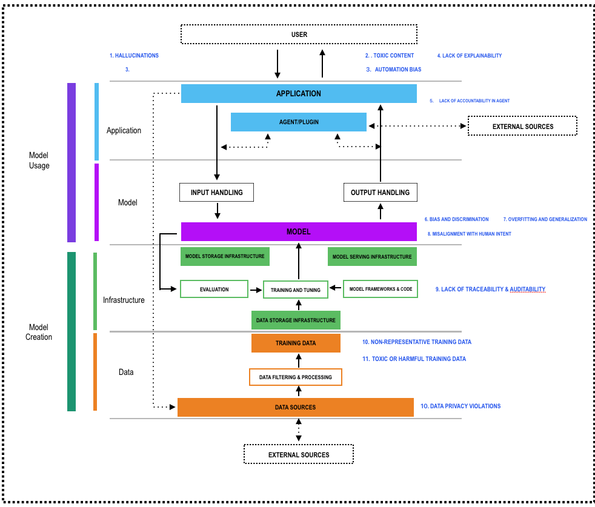

# **2.1.2 AI システム RAI の脅威を特定する (Identify AI System RAI threats)**

## **セキュリティの枠を超えた脅威モデリングの拡張 (Expanding Threat Modeling Beyond Security)**

Modern AI systems are not only susceptible to technical security threats like prompt injection or data poisoning, but also to ethical, social, and governance risks that affect trustworthiness, fairness, and compliance.  
Threat Modeling performed in the previous paragraph is not enough, we need to expand the approach.  
Before we review it, let's briefly revisit key Responsible AI concepts defined by NIST and European Commission guidelines:

* Explainability & Transparency: AI outputs must be understandable to users.  
* Fairness & Non-discrimination: AI must avoid bias and discriminatory outcomes.  
* Robustness & Security: AI must withstand unintended use and adversarial attacks.  
* Privacy & Data Governance: Personal data must be respected and protected.  
* Human Agency & Oversight: AI systems should not undermine human autonomy or create excessive agency.  
* Accountability: Clear responsibility mechanisms must exist for AI decisions.

Based on these concepts, we carefully revise your previous identification of threats:  

  

*Fig. 3: Responsible AI Threat modeling*

### **責任ある AI 追加のみ (Responsible AI Additions Only)**

#### **🟦 AI アプリケーション (追加 5) (AI Application (5 additions)):**

1. Hallucinations (T01-HAL)
2. Toxic Content Generation (T01-TCG)
3. Automation Bias (T01-AB)
4. Lack of Explainability (T01-LoE)
5. Lack of Accountability in Agent/Plugin Actions (T01-LoA)

#### **🟪 AI モデル (追加 3) (AI Model (3 additions)):**

6. Bias and Discrimination (T01-B&D)
7. Overfitting and Generalization (T01-O&G)
8. Misalignment with Human Intent (T01-MHI)

#### **🟩 AI インフラストラクチャ (追加 2) (AI Infrastructure (2 additions)):**

9. Lack of Traceability (T01-LoT) & Lack of Auditability (T01-LoA) of Infrastructure Processes

#### **🟨 AI データ (追加 3) (AI Data (3 additions)):**

10. Non-representative Training Data (T01-NRTD)  
11. Toxic or Harmful Training Data (T01-T&HD)
12. Data Privacy Violations (T01-DPV)

The following tables provide a structured overview, facilitating clear visibility for identifying, managing, and mitigating critical Responsible AI (RAI) threats across your entire AI system architecture.

## **🟦 AI アプリケーション RAI 脅威 (AI Application RAI Threats)**

| \# | Component | Responsible AI Threats |
| ----- | ----- | ----- |
| 1 | Application & User Interaction | Hallucinations, Toxic Content Generation, Automation Bias, Lack of Explainability |
| 2 | Agent/Plugin | Lack of Accountability in Agent/Plugin Actions |

## **🟪 AI モデル RAI 脅威 (AI Model RAI Threats)**

| \# | Component | Responsible AI Threats |
| ----- | ----- | ----- |
| 3 | Model (Inference & Training) | Bias and Discrimination, Overfitting and Generalization, Misalignment with Human Intent |

## **🟩 AI インフラストラクチャ RAI 脅威 (AI Infrastructure RAI Threats)**

| \# | Component | Responsible AI Threats |
| ----- | ----- | ----- |
| 4 | Infrastructure (Storage, Serving, Frameworks, Training & Evaluation) | Lack of Traceability & Auditability of Infrastructure Processes |

## **🟨 AI データ RAI 脅威 (AI Data RAI Threats)**

| \# | Component | Responsible AI Threats |
| ----- | ----- | ----- |
| 5 | Data (Sources, Processing, Storage) | Non-representative Training Data, Toxic or Harmful Training Data, Data Privacy Violations |

## **AI テストの四つの柱 (Four Pillars of AI Testing)**

Artificial‑intelligence systems blend traditional software, complex data pipelines, and probabilistic models. This hybrid nature means that many well‑established security testing practices (e.g., network scanning, penetration testing, secure‑code review) remain indispensable, yet they are no longer sufficient on their own. AI brings new threat vectors—prompt manipulation, data poisoning, model extraction, and unintended agency, to name only a few—that require purpose‑built test strategies.

To address these emerging risks systematically, we group AI‑specific validation activities into four complementary pillars:

1. AI Application Testing – validating everything a human or downstream machine touches: chat interfaces, APIs, agents/plugins, and multi‑modal UX flows.
2. AI Model Testing – stress‑testing the core model itself throughout training, fine‑tuning, and inference to expose weakness in robustness, fairness, and alignment.
3. AI Infrastructure Testing – hardening the serving stack, orchestration layer, and plug‑in/agent sandbox so that the model’s power cannot be abused.
4. AI Data Testing – assuring the integrity, provenance, diversity, and legality of data that feed the model before, during, and after training.
Together, these pillars create a defense‑in‑depth framework: weaknesses caught late in one pillar are often prevented early in another, and insights from any pillar can be fed back into secure‑by‑design requirements for subsequent releases.

The threat scenarios presented in this guide highlight AI-specific risks and corresponding security considerations. While we identify a range of potential threats, some associated security controls and test procedures fall outside the scope of this guide. Our intent is not to replace or duplicate existing, well-established security testing methodologies, but rather to extend them by focusing on threats unique to AI systems.

For broader security assurance across networks, infrastructure, and traditional applications, we recommend using the following foundational testing references, which remain essential for comprehensive system-level evaluations such as Network Security \[17\] *NIST SP 800-115: Technical Guide to Information Security Testing and Assessment*. \[18\] *OSSTMM – Open Source Security Testing Methodology Manual* and \[19\] *OWASP Web Security Testing Guide (WSTG)*.

### **1. AI アプリケーションテスト (AI Application Testing)**

**Scope**
Covers all components exposed directly to users or external environments:
- Front-end UX  
- APIs  
- Agents / Plugins  
- User–AI interactions  

**Key Threats**
- Prompt Injection (LLM01)
- Improper Output Handling (LLM05) 
- Excessive Agency (LLM06)  
- Misinformation (LLM09)  
- Automation Bias  
- Hallucinations  
- Toxic or Harmful Content  
- Explainability Gaps  

**Testing Focus**
- Consistent model behavior across sessions  
- Ethical and safety-oriented content validation  
- UI-driven abuse (e.g., AI-assisted phishing vectors)  
- Interpretability & transparency evaluation  

### **2. AI モデルテスト (AI Model Testing)**

**Scope**
Addresses the internal behavior and lifecycle of AI models:
- Model training  
- Fine-tuning  
- Inference-time decision making  

**Key Threats**
- Model & Data Poisoning (LLM04)
- Inversion & Membership Inference Attacks  
- Bias, Discrimination & Fairness Issues  
- Model Exfiltration (API or runtime)  
- Overfitting / Generalization Weaknesses  
- Explainability & Fairness Gaps  

**Testing Focus**
- Adversarial Robustness Evaluation  
- Fairness & Bias Auditing  
- Membership Inference & Privacy Testing  
- Alignment Testing (behavior in edge or adversarial scenarios)  

### **3. AI インフラストラクチャテスト (AI Infrastructure Testing)**

**Scope**
Focuses on the security of the systems hosting, serving, and orchestrating AI:
- Model hosting & serving infrastructure  
- APIs and service gateways  
- Plugin / agent permissions & execution environment  
- Orchestration and deployment pipelines  

**Key Threats**
- System Prompt Leakage (LLM07)
- Resource Abuse / Unbounded Consumption (LLM10) 
- Supply Chain Poisoning (LLM03)  
- Unauthorized API Control  
- Insecure Agent or Plugin Capabilities  

**Testing Focus**
- Least Privilege & Permission Boundary Enforcement  
- Resource Sandboxing & Rate Limiting  
- Plugin / Agent Isolation & Boundary Testing  
- Environment Security (CI/CD, containers, secrets management)  

### **4. AI データテスト (AI Data Testing)**

**Scope**
Covers the full lifecycle of data used to train, fine-tune, and evaluate models:
- Data collection & ingestion  
- Dataset curation  
- Storage & filtering  
- Labeling & preprocessing  

**Key Threats**
- Data Poisoning (LLM04)
- Training Data Leakage  
- Toxic, Biased, or Unrepresentative Data  
- Bias Introduction During Preprocessing  
- Mislabeling or Inconsistent Filtering  

**Testing Focus**
- Dataset Integrity & Label Quality  
- Bias and Diversity Analysis  
- Data Provenance & Source Validation  
- Filtering Robustness (toxicity detection, duplication control)  
