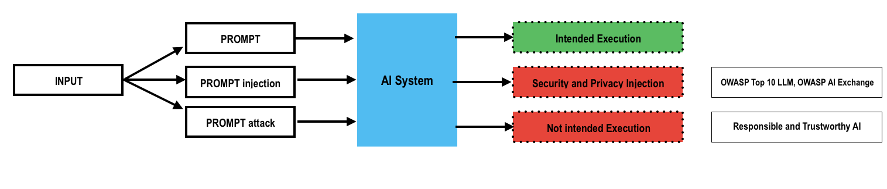

## 付録 F: ドメイン固有テスト (Appendix F: Domain Specific Testing)

The AI Testing Guide framework is structured around four core layers of a typical AI Architecture:
- Application Layer
- Model Layer
- Infrastructure Layer
- Data Layer

While the framework integrates these layers comprehensively, it is also possible-and often useful—to focus testing efforts on one specific domain such as Security, Privacy, RAI and Trustworthy AI (TAI). 

It is useful to understand which tests are related to Security and Privacy and which to RAI and TAI.

We define the following three kinds of Input for an AI System:

  

**1) Prompt (Intended Prompt)**  
This is the standard, intended input given to the AI system by the designer or user without any malicious intent or attempt to manipulate the system. This type of input aligns with the intended functionality and expected behavior of the AI model.

- **Example:** Asking the AI to summarize an article, answer a customer query, or generate text according to specified instructions.

**2) Prompt Injection**  
This type of input refers to scenarios where the user intentionally or unintentionally provides prompts designed to manipulate or override the intended behavior of the AI system, causing it to produce unintended, possibly harmful, or sensitive outputs. It can be divided into two categories:

- **Direct Prompt Injection:** User directly inputs text commands explicitly intended to manipulate model behavior.
- **Indirect Prompt Injection:** Malicious prompts embedded within externally sourced content (e.g., web pages, documents) which the model ingests unknowingly.

- **Example:** Injecting instructions to bypass security constraints, reveal private system information, or disregard programmed ethical guidelines.

**3) Prompt Attack**  
Prompt attacks involve specific manipulative prompts designed to exploit inherent model vulnerabilities related to hallucinations (model inventing or confidently providing incorrect information) and Responsible AI (RAI) and Trustworthy considerations (ethical guidelines, fairness, transparency). This category explicitly deals with exploiting known weaknesses in the AI model’s accuracy or ethical controls.

- **Hallucination Attack:** Crafting prompts designed to exploit the model's propensity for fabricating believable but incorrect responses.
  - **Example:** Asking the AI for non-existent historical facts or scientific data, leading to plausible yet entirely fabricated responses.

- **Responsible AI Attack (RAI Attack):** Prompts intentionally exploiting or subverting ethical and fairness-related constraints.
  - **Example:** Manipulating the model to generate biased, toxic, or inappropriate outputs, contrary to established ethical standards.

---

Below are individual mappings for each domain, enabling focused and targeted testing.

## セキュリティドメインテスト (Security Domain Testing)

| Test ID       | Test Name & Link |
|---------------|------------------|
| **AITG-APP-01**   | [Testing for Prompt Injection](/Document/content/tests/AITG-APP-01_Testing_for_Prompt_Injection.md) |
| **AITG-APP-02**   | [Testing for Indirect Prompt Injection](/Document/content/tests/AITG-APP-02_Testing_for_Indirect_Prompt_Injection.md) |
| **AITG-APP-03**   | [Testing for Sensitive Data Leak](/Document/content/tests/AITG-APP-03_Testing_for_Sensitive_Data_Leak.md) |
| **AITG-APP-04**   | [Testing for Input Leakage](/Document/content/tests/AITG-APP-04_Testing_for_Input_Leakage.md) |
| **AITG-APP-05**   | [Testing for Unsafe Outputs](/Document/content/tests/AITG-APP-05_Testing_for_Unsafe_Outputs.md) |
| **AITG-APP-06**   | [Testing for Agentic Behavior Limits](/Document/content/tests/AITG-APP-06_Testing_for_Agentic_Behavior_Limits.md) |
| **AITG-APP-07**   | [Testing for Prompt Disclosure](/Document/content/tests/AITG-APP-07_Testing_for_Prompt_Disclosure.md) |
| **AITG-APP-08**   | [Testing for Embedding Manipulation](/Document/content/tests/AITG-APP-08_Testing_for_Embedding_Manipulation.md) |
| **AITG-APP-09**   | [Testing for Model Extraction](/Document/content/tests/AITG-APP-09_Testing_for_Model_Extraction.md) |
| **AITG-MOD-01**   | [Testing for Evasion Attacks](/Document/content/tests/AITG-MOD-01_Testing_for_Evasion_Attacks.md) |
| **AITG-MOD-02**   | [Testing for Runtime Model Poisoning](/Document/content/tests/AITG-MOD-02_Testing_for_Runtime_Model_Poisoning.md) |
| **AITG-MOD-03**   | [Testing for Poisoned Training Sets](/Document/content/tests/AITG-MOD-03_Testing_for_Poisoned_Training_Sets.md) |
| **AITG-INF-01**   | [Testing for Supply Chain Tampering](/Document/content/tests/AITG-INF-01_Testing_for_Supply_Chain_Tampering.md) |
| **AITG-INF-02**   | [Testing for Resource Exhaustion](/Document/content/tests/AITG-INF-02_Testing_for_Resource_Exhaustion.md) |
| **AITG-INF-05**   | [Testing for Fine-tuning Poisoning](/Document/content/tests/AITG-INF-05_Testing_for_Fine-tuning_Poisoning.md) |
| **AITG-INF-06**   | [Testing for Dev-Time Model Theft](/Document/content/tests/AITG-INF-06_Testing_for_Dev-Time_Model_Theft.md) |
| **AITG-DAT-02**   | [Testing for Runtime Exfiltration](/Document/content/tests/AITG-DAT-02_Testing_for_Runtime_Exfiltration.md) |

---

## 🛡️ プライバシードメインテスト (Privacy Domain Testing)

| Test ID       | Test Name & Link |
|---------------|------------------|
| **AITG-APP-03**   | [Testing for Sensitive Data Leak](/Document/content/tests/AITG-APP-03_Testing_for_Sensitive_Data_Leak.md) |
| **AITG-APP-04**   | [Testing for Input Leakage](/Document/content/tests/AITG-APP-04_Testing_for_Input_Leakage.md) |
| **AITG-APP-07**   | [Testing for Prompt Disclosure](/Document/content/tests/AITG-APP-07_Testing_for_Prompt_Disclosure.md) |
| **AITG-MOD-04**   | [Testing for Membership Inference](/Document/content/tests/AITG-MOD-04_Testing_for_Membership_Inference.md) |
| **AITG-MOD-05**   | [Testing for Inversion Attacks](/Document/content/tests/AITG-MOD-05_Testing_for_Inversion_Attacks.md) |
| **AITG-INF-06**   | [Testing for Dev-Time Model Theft](/Document/content/tests/AITG-INF-06_Testing_for_Dev-Time_Model_Theft.md) |
| **AITG-DAT-01**   | [Testing for Training Data Exposure](/Document/content/tests/AITG-DAT-01_Testing_for_Training_Data_Exposure.md) |
| **AITG-DAT-02**   | [Testing for Runtime Exfiltration](/Document/content/tests/AITG-DAT-02_Testing_for_Runtime_Exfiltration.md) |
| **AITG-DAT-05**   | [Testing for Data Minimization & Consent](/Document/content/tests/AITG-DAT-05_Testing_for_Data_Minimization_and_Consent.md) |

---

## ⚖️ 責任ある AI (RAI) ドメインテスト (Responsible AI (RAI) Domain Testing)

| Test ID       | Test Name & Link |
|---------------|------------------|
| **AITG-APP-05**   | [Testing for Unsafe Outputs](/Document/content/tests/AITG-APP-05_Testing_for_Unsafe_Outputs.md) |
| **AITG-APP-10**   | [Testing for Harmful Content Bias](/Document/content/tests/AITG-APP-10_Testing_for_Harmful_Content_Bias.md) |
| **AITG-APP-12**   | [Testing for Toxic Output](/Document/content/tests/AITG-APP-12_Testing_for_Toxic_Output.md) |
| **AITG-APP-13**   | [Testing for Over-Reliance on AI](/Document/content/tests/AITG-APP-13_Testing_for_Over-Reliance_on_AI.md) |
| **AITG-APP-14**   | [Testing for Explainability and Interpretability](/Document/content/tests/AITG-APP-14_Testing_for_Explainability_and_Interpretability.md) |
| **AITG-INF-04**   | [Testing for Capability Misuse](/Document/content/tests/AITG-INF-04_Testing_for_Capability_Misuse.md) |
| **AITG-DAT-03**   | [Testing for Dataset Diversity & Coverage](/Document/content/tests/AITG-DAT-03_Testing_for_Dataset_Diversity_and_Coverage.md) |
| **AITG-DAT-04**   | [Testing for Harmful Content in Data](/Document/content/tests/AITG-DAT-04_Testing_for_Harmful_Content_in_Data.md) |

---

## ✅ 信頼できる AI ドメインテスト (Trustworthy AI Domain Testing)

| Test ID       | Test Name & Link |
|---------------|------------------|
| **AITG-APP-06**   | [Testing for Agentic Behavior Limits](/Document/content/tests/AITG-APP-06_Testing_for_Agentic_Behavior_Limits.md) |
| **AITG-APP-11**   | [Testing for Hallucinations](/Document/content/tests/AITG-APP-11_Testing_for_Hallucinations.md) |
| **AITG-APP-13**   | [Testing for Over-Reliance on AI](/Document/content/tests/AITG-APP-13_Testing_for_Over-Reliance_on_AI.md) |
| **AITG-APP-14**   | [Testing for Explainability and Interpretability](/Document/content/tests/AITG-APP-14_Testing_for_Explainability_and_Interpretability.md) |
| **AITG-MOD-06**   | [Testing for Robustness to New Data](/Document/content/tests/AITG-MOD-06_Testing_for_Robustness_to_New_Data.md) |
| **AITG-MOD-07**   | [Testing for Goal Alignment](/Document/content/tests/AITG-MOD-07_Testing_for_Goal_Alignment.md) |
| **AITG-INF-03**   | [Testing for Plugin Boundary Violations](/Document/content/tests/AITG-INF-03_Testing_for_Plugin_Boundary_Violations.md) |
| **AITG-INF-04**   | [Testing for Capability Misuse](/Document/content/tests/AITG-INF-04_Testing_for_Capability_Misuse.md) |
| **AITG-DAT-05**   | [Testing for Data Minimization & Consent](/Document/content/tests/AITG-DAT-05_Testing_for_Data_Minimization_and_Consent.md) |
