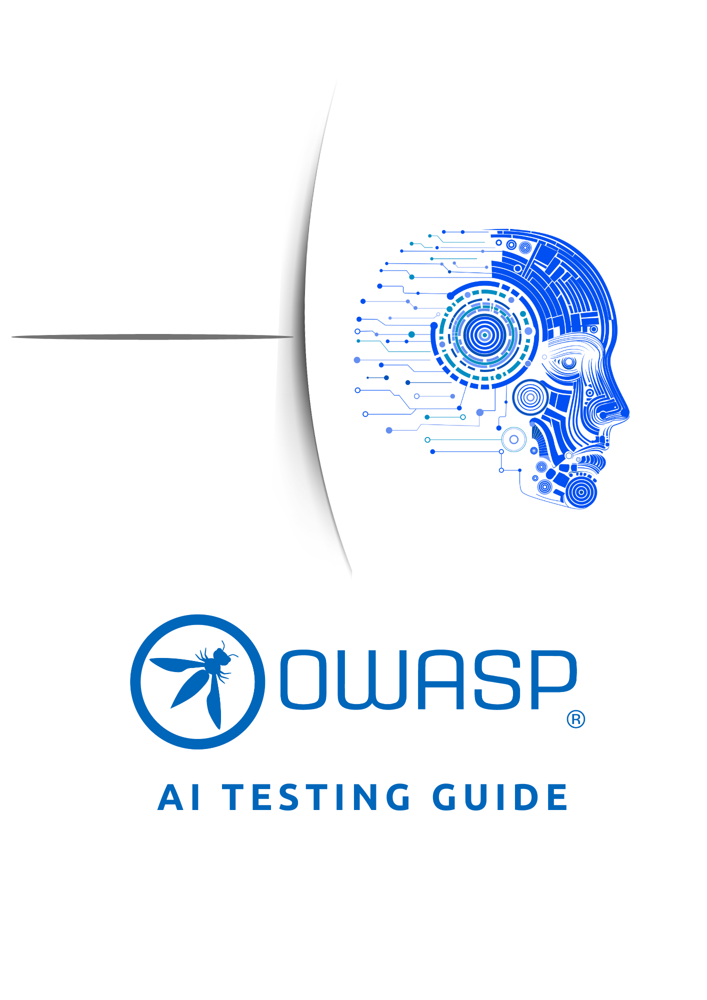

# OWASP AI テストガイドへようこそ！

---

OWASP AI Testing Guide project is an open-source initiative aimed at providing comprehensive, structured methodologies and best practices for testing artificial intelligence systems.

As AI systems become more integral to critical applications, ensuring their reliability, security, and ethical alignment is paramount. Testing AI systems presents unique challenges that differ significantly from traditional software testing, necessitating specialized approaches and methodologies.

  

## 既存のリソースとイニシアチブ

Recognizing the need for structured approaches to AI testing, several organizations have developed comprehensive guides and frameworks:

- **OWASP GenAI Red Teaming Guide**: This guide offers a structured, risk-based methodology for assessing AI systems, covering aspects from model evaluation to system integration pitfalls. It emphasizes a holistic approach to red teaming, addressing model-level vulnerabilities and runtime behavior analysis.[OWASP GenAI Red Teaming Guide](https://genai.owasp.org/resource/genai-red-teaming-guide/)

- **CSA Agentic AI Red Teaming Guide**: Offers guidance on red teaming agentic AI systems, addressing attack surfaces unique to autonomous and goal-driven AI behaviors. CSA Guide
[Cloud Security Alliance Agentic AI Red Teaming Guide](https://lnkd.in/ere2Jm9D (https://cloudsecurityalliance.org/artifacts/agentic-ai-red-teaming-guide#) [Cloud Security Alliance Agentic AI Red Teaming Guide](https://cloudsecurityalliance.org/artifacts/agentic-ai-red-teaming-guide#)

- **OWASP AI Exchange**: Serving as a collaborative platform, the AI Exchange provides over 200 pages of practical advice on protecting AI and data-centric systems from threats. It contributes actively to international standards and represents a consensus on AI security and privacy. [OWASP AI Exchange](https://owaspai.org/)

- **OWASP AI Security and Privacy Guide**: This working document offers clear and actionable insights on designing, creating, testing, and procuring secure and privacy-preserving AI systems. [OWASP AI Security and Privacy Guide](https://owasp.org/www-project-ai-security-and-privacy-guide/)

- **OWASP Top 10 for LLM**: Top 10 risks, vulnerabilities and mitigations for developing and securing generative AI and large language model applications across the development, deployment and management lifecycle. [OWASP Top 10 for Large Language Models (LLM)](https://owasp.org/www-project-top-10-for-large-language-model-applications/)

- **OWASP AI VSS (AI Vulnerability Scoring System)**: A tailored scoring framework designed to assess and quantify AI-specific vulnerabilities. It adapts principles from traditional CVSS to the AI domain, offering consistent and actionable risk ratings for model flaws, data weaknesses, and deployment exposures. [OWASP AI VSS](https://aivss.owasp.org/)
  
- **NIST AI 100-2 E2025**: Adversarial Machine Learning A Taxonomy and Terminology of Attacks and Mitigations: [NIST AI 100](https://nvlpubs.nist.gov/nistpubs/ai/NIST.AI.100-2e2025.pdf)

## 本ガイドの目的

This open-source guide aims to consolidate knowledge, and create a new methodology for testing AI systems. By leveraging existing resources and incorporating insights from the broader AI and cybersecurity communities, we seek to provide a comprehensive framework that addresses the multifaceted challenges of AI testing. Our goal is to empower practitioners, researchers, and organizations to develop and deploy AI systems that are not only innovative but also secure, reliable, and ethically sound.

NEXT:  [AI Testing Guide Table of Content](Document/README.md)

## コラボレーション

For contributions, feedback, or collaboration, reach out to the project leaders:

- **Matteo Meucci**: 
[matteo.meucci@owasp.org](mailto:matteo.meucci@owasp.org)
- **Marco Morana**: [marco.m.morana@gmail.com](mailto:marco.m.morana@gmail.com)

