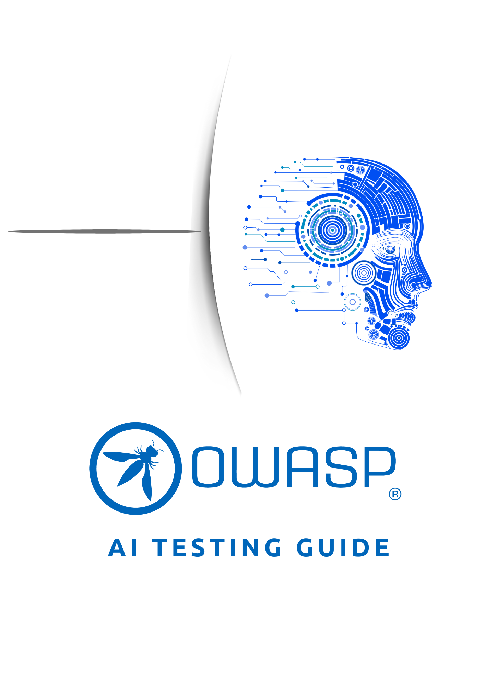

---

layout: col-sidebar
title: OWASP AI テストガイド
tags: AITG
level: 4
type: documentation
pitch: AI システム評価を実行するための方法論

---

  

# 📢 2025年 11月 26日 — バージョン 1 公開

**OWASP AI テストガイド v1** が正式にリリースされました。  
このマイルストーンは、AI システムの信頼性テストについての初めてのコミュニティ駆動のオープンな標準となります。

👉 **[PDF (英語版)](https://github.com/OWASP/www-project-ai-testing-guide/blob/d641514cbd73a0a197ea4f814ddb198285a19447/PDFGenerator/V1.0/OWASP-AI-Testing-Guide-v1.pdf) をダウンロード**

👉 **[GitHub (英語版)](https://github.com/OWASP/www-project-ai-testing-guide/blob/main/Document/README.md) で閲覧**

# AI の信頼性の基盤としての AI テスト

人工知能は革新的な技術から現代のデジタルインフラストラクチャの重要な構成要素へと移行しました。現在、AI システムは医療、金融、モビリティ、公共サービス、エンタープライズオートメーションにおいて重要な意思決定をサポートしています。これらのシステムの適用範囲と自律性が拡大するにつれ、組織は AI が意図したとおりに安全に動作することを検証するための、標準化された反復可能な方法を必要としています。

OWASP AI テストガイドは、AI システムの信頼性テストの実用的な標準を確立することでこのギャップを埋め、セキュリティ脅威だけでなく、責任ある規制に準拠した AI デプロイメントに必要なより広範な信頼性特性を評価する、統一され、テクノロジに依存しない方法論を提供します。

AI テストはもはやセキュリティだけにとどまらず、自律型および半自動型システムにおける信頼性の維持に重点を置いた学際的な分野となっています。OWASP AI テストガイドは欠けていた標準を確立します。実際の攻撃パターン、新たなグローバル標準、AI セキュリティコミュニティの実体験に基づく、AI システムの信頼性テストのための統一的、実用的、包括的なフレームワークです。

### AI テストがユニークな理由

従来のソフトウェアテストは、不正アクセス、コードの欠陥、システムの脆弱性からシステムを保護することに重点を置いています。AI システムはそれ以上を必要としています。AI モデルは非決定論的な方法で学習、適用、汎化、そして失敗するため、従来のセキュリティテストでは対処できないリスクをもたらします。

NIST AML Taxonomy と OWASP Top 10 for LLM Applications 2025 に記載されている証跡から、AI システムの障害はセキュリティをはるかに超える原因で発生することが分かっています。

* 敵対的操作 (プロンプトインジェクション、ジェイルブレイク、モデル回避)
* バイアスと公平性の欠陥
* 機密情報の漏洩
* ハルシネーションと誤情報
* サプライチェーン全体にわたるデータ/モデルポイズニング
* 過剰または安全でないエージェンシー
* ユーザーの意図や組織のポリシーとの不整合
* 透明性のない出力や説明できない出力
* 時間経過に伴うモデルドリフトとデグレーション

こうした複雑さのため、業界は以下の原則に収束しつつあります。  
セキュリティは十分ではなく、AI の信頼性が真の目的である。  
この OWASP AI テストガイドはこれらの原則を実用的にテストフレームワークとして運用化します。

AI モデルは、巧妙に細工された入力 (敵対的サンプル) によって欺かれたり操作される可能性があります。組織は標準的な機能テストをはるかに超える専用の敵対的堅牢性テスト方法論を採用する必要があります。これらの専門的なセキュリティ評価がなければ、AI システムは完全性、信頼性、全体的な信憑性を損なう可能性のある巧妙な攻撃に脆弱なままとなります。

### OWASP AI テストガイドの目的とスコープ

OWASP AI テストガイドは以下を提供します。
* AI および LLM ベースシステムの信頼性テストのための標準化された方法論
* 以下のリスクを評価する繰り返し可能なテストケース:
  - AI アプリケーション層
  - AI モデル層
  - AI インフラストラクチャ層
  - AI データ層

本ガイドは、ソフトウェア開発者、アーキテクト、データアナリスト、研究者、監査担当者、リスク担当者にとっての包括的なリファレンスとして機能するように設計されており、製品開発ライフサイクル全体を通じて AI リスクが体系的に対処されることを確保します。

### [こちら](https://github.com/OWASP/www-project-ai-testing-guide) から貢献を始めましょう
